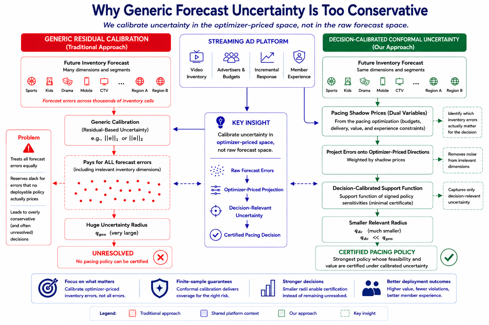

# Decision-Calibrated Conformal Uncertainty for Pacing Decisions

[](LICENSE)




Notebook-first code companion for **Decision-Calibrated Conformal Uncertainty for Pacing Decisions in Streaming Advertising**.

Reusable code lives in `src/`; user-facing experiments live in `notebooks/`; generated outputs are written to `artifacts/` and ignored by git. The implementation follows the paper directly. It builds public-data-calibrated streaming marketplaces, creates historical state features from past inventory, demand, quality, seasonality, and lagged block totals, computes block-specific objective and constraint sensitivity directions from nominal catalog relaxations, forms the dual-weighted support-function score, calibrates value and constraint support radii with split conformal prediction and a Bonferroni component split, and applies the robust pacing selector. Each forecaster returns both the point forecast used by the optimizer and a calibrated max-coordinate prediction band for reproducibility diagnostics.

## Setup

```bash
uv sync
uv run jupyter lab
```

If `uv` is unavailable, the same environment can be created with standard Python tooling.

```bash
python3 -m venv .venv
. .venv/bin/activate
python -m pip install -e .
python -m ipykernel install --user --name forecast-calibrated-causal-pacing
jupyter lab
```

## Data

Keep all datasets in the local repository-level `data/` folder, not inside this code directory. In this workspace, use this path.

```text
/home/apex/Documents/ranking_sys/data/
```

When running from this `code/` directory, the implementation looks for data through the repository root and records dataset availability in `00_dataset_readiness.ipynb`. Large raw files, processed data, and generated outputs should stay local and should not be committed.

PyTorch is a required dependency for the full workflow because every public-data-calibrated case fits the complete forecasting bundle, including `torch_gru` and `torch_transformer` sequence forecasters. Both models use GPU by default when CUDA is available, then Apple MPS if available, and otherwise fall back to CPU. For CUDA-specific wheels, follow the install command recommended by the PyTorch project for your machine before running `python -m pip install -e .`.

## Notebook Map

| Notebook | Paper role | What it implements | Primary artifacts |
|---|---|---|---|
| `00_dataset_readiness.ipynb` | Reproducibility | Checks Criteo and KuaiRand/KuaiRec inputs and records archive availability. | `00_dataset_readiness.csv` |
| `01_main_decision_calibrated_pacing.ipynb` | Main body | Compares point forecast, generic-residual conformal, and decision-calibrated robust pacing on Criteo and KuaiRand-calibrated streaming cases, with violation rates measured across held-out blocks. | `01_main_pacing_results.csv`, `main_pacing_comparison.png` |
| `02_main_forecaster_radius_yield.ipynb` | Main body | Compares forecasting modules, including seasonal ridge, random features, gradient boosting, numpy MLP, GPU-default `torch_gru`, and GPU-default `torch_transformer`, by MSE, decision-calibrated radius, generic radius, selected policy, and realized yield. | `02_forecaster_comparison.csv`, `main_forecaster_radius_yield.png` |
| `03_main_causal_response_pacing.ipynb` | Main body | Compares predicted response, doubly robust response, and robust causal-response radii inside the same pacing selector. | `03_causal_response_modes.csv`, `main_causal_response_modes.png` |
| `04_appendix_theory_geometry_calibration.ipynb` | Appendix | Tests sharp support-function equality/minimality, split-conformal coverage, and high-dimensional separation. | `04_*`, `appendix_theory_geometry.png` |
| `05_appendix_certificate_slack_catalog.ipynb` | Appendix | Tests robust certificate diagnostics, slack necessity, finite-catalog approximation, and theory-to-artifact mapping. | `05_*` |
| `06_appendix_sensitivity_ablations.ipynb` | Appendix | Runs catalog granularity, causal-response misspecification, budget pressure, member-experience pressure, and dual-weighted-versus-unweighted forecast-error ablations. | `06_*` |
| `07_appendix_calibration_sample_size.ipynb` | Appendix | Tests the calibration sample-size proposition by resampling calibration blocks, recomputing component support-function radii, rerunning the robust selector, and comparing quantile error to the empirical decision margin. | `07_*`, `appendix_calibration_sample_size.png` |

## Paper-to-Code Claims

| Paper claim | Code location |
|---|---|
| The score is the support function `max_pi |<w_pi, z - zhat>|`. | `src/pacing.py::decision_scores`, `src/theory_checks.py::sharp_support_function_check` |
| Dual prices come from a nominal pacing relaxation. | `src/pacing.py::nominal_dual_prices` |
| Split conformal calibrates the Lagrangian decision score and jointly protects the value/constraint support scores used by the selector. | `src/forecasting.py::conformal_quantile`, `src/pacing.py::calibrate_radii` |
| Calibration-block sample size controls stability of component quantiles and the selected robust pacing policy. | `src/experiments.py::calibration_sample_size_diagnostic`, notebook `07` |
| Robust selector uses lower confidence value and upper confidence constraints. | `src/pacing.py::robust_select` |
| Forecasting layer supports optimizer point forecasts and calibrated prediction bands. | `src/forecasting.py::fit_all_forecasters` |
| Campaign-to-context assignment affects segment-level value, delivery, and budget sensitivities. | `src/simulation.py::generate_streaming_case`, `src/pacing.py::policy_coefficients` |
| Forecasters map historical streaming states into future inventory, demand, and opportunity-quality forecasts. | `src/simulation.py::generate_streaming_case`, `src/forecasting.py::fit_all_forecasters` |
| Forecasting modules are judged by downstream decision radius and yield, not MSE alone. | `src/experiments.py::compare_forecasters` |
| Causal-response and member-experience uncertainty enter through empirical DR-response and calibration-member radii controlled by `alpha_tau` and `alpha_m`. | `src/pacing.py::policy_radii`, `src/experiments.py::_attach_effect_radii`, `src/experiments.py::compare_causal_response_modes` |
| All theoretical results have empirical diagnostics. | `src/theory_checks.py`, notebooks `04`, `05`, and `07` |

## Outputs

Running notebooks writes the following generated outputs.

- `artifacts/tables/*.csv`
- `artifacts/figures/*.png`

Generated artifacts are ignored by git except placeholder `.gitkeep` files.

## License

MIT. See `LICENSE`.
